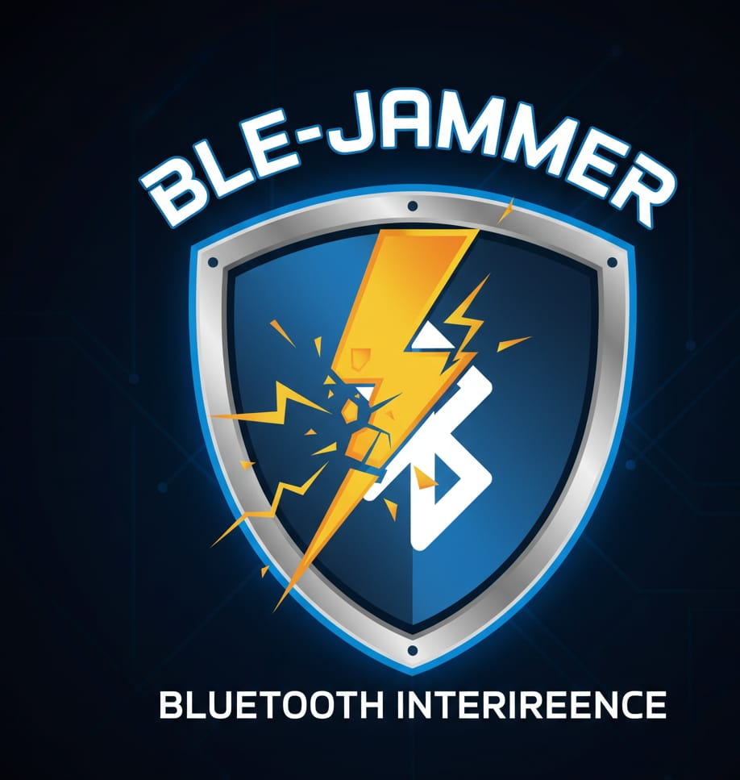
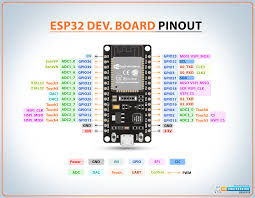
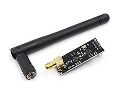
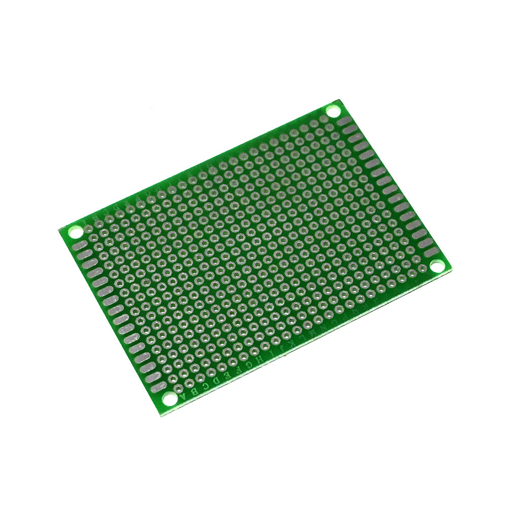

  
  <h1> 🌟Ble-Jammer 🌟 </h1>

# Ble-Jammer
Ble-jammer is a hardware-based BLE interference/testing toolkit that uses an ESP32 (for control and RF activation) together with nRF-series radio modules to generate controlled Bluetooth Low Energy interference and test resilience of BLE devices in a lab environment. The project provides firmware, scripts, 

# Components used

<strong>Esp-32</strong>
 

## What is ESP-32

 **Microcontroller with Built-In Wi-Fi and Bluetooth**
<ul><li>The ESP32 is a low-cost microcontroller chip made by Espressif Systems that includes Wi-Fi and Bluetooth (BLE) for wireless communication.</li></ul>

**Dual-Core Processor**
<ul><li>It has a dual-core Tensilica Xtensa CPU, which allows it to handle multiple tasks at once — ideal for IoT and embedded applications. </li></ul>

 **Multiple I/O Pins and Sensors**
<ul><li>The ESP32 includes GPIO pins, ADC/DAC, PWM, SPI, I²C, and UART interfaces, making it versatile for sensors, motors, and other hardware connections.</li></ul>

 **Power-Efficient and Portable**
<ul><li>It supports various low-power modes, making it suitable for battery-powered and portable IoT projects.</li></ul>

-----

 

<strong>nRF24-Module</strong>

 ## what is nRF24 module
 
 
 **Wireless Transceiver**
 <ul><li>Operates at 2.4 GHz frequency for reliable short-range communication between devices like Arduino or ESP32.</li></ul>

 **Low Power & High Speed:**
 <ul><li> Supports fast data transfer (up to 2 Mbps) with low energy consumption, ideal for battery-powered projects.</li></ul>

 **Used in IoT & Robotics:**
 <ul><li> Commonly used for wireless sensor networks, remote controls, and robot communication systems.</li></ul>
 
  -----
  
 

<strong>PCB</strong>

## what is PCB

**Purpose**
<ul><li>PCB soldering connects electronic components to the board by melting solder, ensuring proper electrical and mechanical contact.</li></ul>

**Tools Used:**
<ul><li>Requires a soldering iron, flux, solder wire, and PCB holder/stand to keep the board steady during work.</li></ul>

**Precision & Safety:**
<ul><li>  Proper soldering ensures strong joints, stable performance, and prevents short circuits or component damage.  </li></ul>

-----

<strong>Jumper wire</strong>

  
## what is jumper wire
  

**Connection Purpose**
<ul><li>Jumper wires are used to connect components on a breadboard or between modules without soldering. </li></ul>

**Types:**
<ul><li>Available as male-to-male, male-to-female, and female-to-female depending on the pin connection needs.</li></ul>

**Easy & Reusable**
<ul><li>They are flexible, color-coded, and reusable, making them ideal for prototyping and circuit testing.</li></ul>

-----

-----

# Installation of Code in ESP-32
## Step 1 :-
<ul><li> Connect your ESP-32 with your laptop/computer using USB </li></ul>
<ul><li> chech driver if in your system dont have an driver then download according to you ESP-32 Chip see on the chip on your esp32</li></ul>
<ul><li>if chip is CP2102 Chip  then download <a href="https://www.silabs.com/developers/usb-to-uart-bridge-vcp-drivers">link</a>  </li></ul>
<ul><li>if your chip is CH341 chip then download driver <a href="https://www.wch-ic.com/downloads/ch341ser_exe.html">Link</a> </li></ul>

## step 2 :-
<ul>Go to this site https://esp32-bluejammerflasher.pages.dev/ and then connect your esp32 and they show your esp32 then click on it, when installing make sure click and hold the boot button on your esp32 </ul>
<ul> its may take few minutes and its done next step is wiring  </ul>

